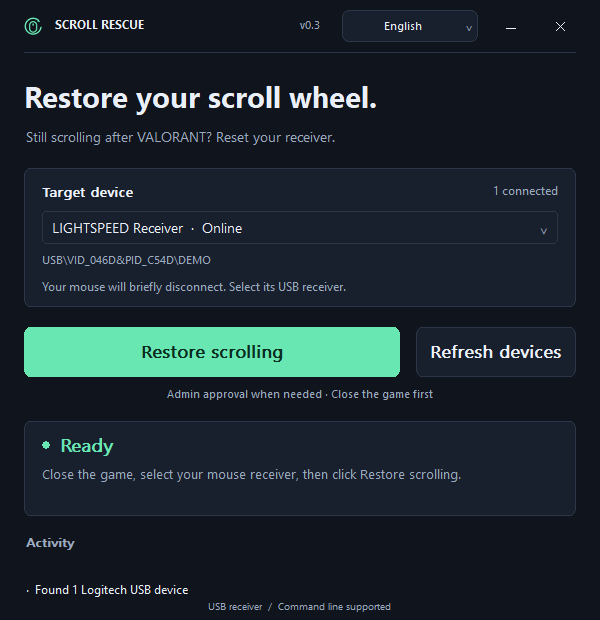

# Scroll Rescue

English · [简体中文](README.md)

If a Logitech mouse keeps scrolling after you exit VALORANT, this tool can restart its USB receiver. Includes a portable GUI and command line for Windows 10 version 2004 or later and Windows 11, x64. Bluetooth devices are outside its scope.

## Platform support

| Platform | Availability |
| --- | --- |
| Windows 10 version 2004 or later / Windows 11, x64 | GUI, command line and automated packages |
| Windows ARM64 / x86 | No dedicated packages yet |
| macOS / Linux | Not supported |

This is currently a Windows-only application. Automated packaging does not change which operating systems it supports.

## Screenshot



## GUI

Open `scroll-rescue.exe`, select your mouse's USB receiver, close the game and click **Restore scrolling**. Allow administrator approval when prompted. Your mouse will briefly disconnect. Test the wheel afterward; a device returning online does not confirm that the scrolling symptom is fixed.

Drag the custom title bar to move the window. The upper-right buttons minimize and close it. Tab and Enter work with buttons; use the arrow keys and Escape in the device list.

The language button offers **System default**, **简体中文** and **English**. Switching takes effect immediately and is remembered for the next launch. On first launch, Chinese Windows display languages use Simplified Chinese; all others use English. Device names remain as reported by Windows.

To open the GUI in English for this run only:

```powershell
Start-Process .\scroll-rescue.exe -ArgumentList '--lang en'
```

## Command line

Open PowerShell in the extracted directory:

```powershell
.\scroll-rescue-cli.ps1 --lang en --help
.\scroll-rescue-cli.ps1 devices
.\scroll-rescue-cli.ps1 devices --json
.\scroll-rescue-cli.ps1 repair --dry-run
.\scroll-rescue-cli.ps1 repair --device 'USB\VID_046D&PID_XXXX\YOUR_DEVICE_ID'
.\scroll-rescue-cli.ps1 repair --all
.\scroll-rescue-cli.ps1 repair --no-elevate
```

A single device is selected automatically. With several devices, use `--device` or `--all`. `--device` can be repeated and cannot be combined with `--all`. `--dry-run` previews without restarting devices. `--no-elevate` exits if administrator approval is needed.

`--lang auto|zh-CN|en` may appear before or after the command. It applies only to the current run. Otherwise the saved language preference is used. `auto` follows the Windows display language. JSON field names and exit codes are stable across languages.

The EXE accepts the same arguments. The PowerShell wrapper waits for completion and preserves output and exit codes. In CMD, use `scroll-rescue-cli.cmd`; put device IDs in double quotes. If PowerShell blocks the local script, run:

```powershell
powershell -NoProfile -ExecutionPolicy Bypass -File .\scroll-rescue-cli.ps1 --lang en devices
```

| Exit code | Meaning |
| --- | --- |
| 0 | Query or preview succeeded, or the device is back online |
| 1 | Restart, approval or execution failed |
| 2 | Invalid arguments or device query failed |
| 3 | No device found |
| 4 | Administrator approval cancelled |
| 5 | Administrator approval required with `--no-elevate` |
| 6 | Restart requested, but the device is not back online |
| 7 | Windows requires a PC restart |

To restart a specific receiver from an administrator terminal, use `pnputil /restart-device` with its complete device ID. See [Microsoft's PnPUtil command reference](https://learn.microsoft.com/en-us/windows-hardware/drivers/devtest/pnputil-command-syntax#restart-device).

## Build

Install the **Desktop development with C++** workload in Visual Studio Build Tools and a Windows 10/11 SDK, then run:

```powershell
.\scripts\build.ps1
.\scripts\package.ps1 -SkipBuild
```

The executable is written to `build/release/scroll-rescue.exe` and the portable package to `dist/scroll-rescue-cpp-windows-x64.zip`. No additional runtime installation is required.

## GitHub automated builds

Push this repository to GitHub and enable Actions:

- Branch pushes and pull requests build the Windows x64 application, check its command line and create a portable package.
- Use **Actions → Build and release → Run workflow** for a manual build.
- Download `scroll-rescue-windows-x64` from the run's **Artifacts**. Extract it to obtain the portable ZIP and its SHA-256 checksum file. Build artifacts are kept for 30 days.
- Pushing a `vMAJOR.MINOR.PATCH` tag that matches the application version publishes the portable ZIP and checksum under **Releases**. Branch pushes and manual builds do not create a release.

The current version is `0.3.0`. After configuring the GitHub remote named `origin`, publish it with:

```powershell
git push origin main
git tag v0.3.0
git push origin v0.3.0
```

For a new version, update the version numbers in `app.manifest`, `src/cli.cpp` and `src/translations.inc` before tagging. A mismatched tag stops publication. Already published versions are never overwritten.

This independent tool is not affiliated with Logitech or Riot Games. The cause of the scrolling symptom has not been established.
