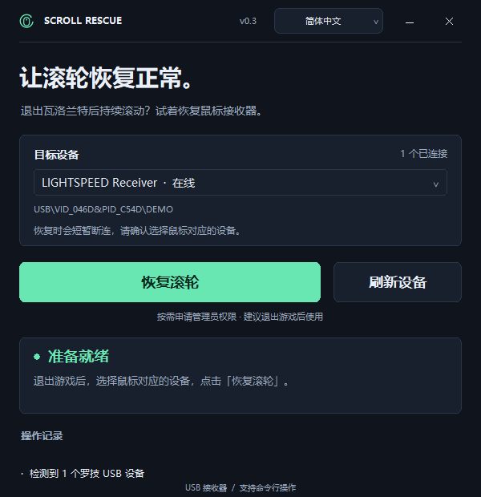

# Scroll Rescue · 罗技滚轮恢复

[English](README.en.md) · 简体中文

退出瓦洛兰特后，罗技鼠标仍持续滚动时，可使用本工具尝试恢复 USB 接收器。提供中英文 GUI 和命令行入口。

## 软件截图



## 使用 GUI

双击 `scroll-rescue.exe`，确认选中鼠标对应的 USB 设备，退出游戏后点击 **恢复滚轮**，允许 Windows 管理员授权。

恢复过程中鼠标会短暂断连。完成后请实际测试滚轮；设备恢复在线不代表已自动验证滚轮症状消失。

顶部栏采用自绘样式。拖动顶部栏移动窗口，右上角按钮用于最小化、关闭。支持 Tab 切换控件、Enter 执行按钮；设备列表支持方向键和 Esc 关闭。

点击顶部的语言按钮，选择 **跟随系统**、**简体中文** 或 **English**，立即切换并记住选择。首次打开时跟随 Windows 显示语言；中文系统使用简体中文，其他语言使用英语。按钮、状态、操作记录和错误提示都会切换，设备名称使用 Windows 提供的名称。

也可仅为本次打开指定语言：

```powershell
Start-Process .\scroll-rescue.exe -ArgumentList '--lang en'
```

支持 Windows 10 2004 及以上版本、Windows 11，x64。适用于 USB 连接的罗技设备，蓝牙设备不在恢复范围内。

## 命令行

在解压目录打开 PowerShell：

```powershell
# 查看设备
.\scroll-rescue-cli.ps1 devices
.\scroll-rescue-cli.ps1 devices --json

# 仅为本次命令选择语言
.\scroll-rescue-cli.ps1 --lang en devices
.\scroll-rescue-cli.ps1 repair --dry-run --lang zh-CN

# 只预览将执行的命令
.\scroll-rescue-cli.ps1 repair --dry-run

# 只有一个设备时自动选择
.\scroll-rescue-cli.ps1 repair

# 多个设备时指定 devices 返回的完整 ID
.\scroll-rescue-cli.ps1 repair --device 'USB\VID_046D&PID_XXXX\YOUR_DEVICE_ID'

# 明确恢复所有列出的罗技 USB 主设备
.\scroll-rescue-cli.ps1 repair --all

# 缺少管理员权限时直接退出
.\scroll-rescue-cli.ps1 repair --no-elevate

.\scroll-rescue-cli.ps1 --help
```

`--device` 可重复使用；与 `--all` 不能同时使用。只有一个设备时可直接运行 `repair`，多个设备时需要明确选择。

`--lang auto|zh-CN|en` 可放在命令前后，只影响本次运行；默认使用已保存的语言选择。`auto` 跟随 Windows 显示语言。`--json` 的字段名和退出码在不同语言下保持一致。

直接使用 EXE 时也支持相同参数。PowerShell 中请等待进程完成再检查退出码，例如：

```powershell
$process = Start-Process .\scroll-rescue.exe -ArgumentList 'repair --dry-run' -Wait -PassThru
$process.ExitCode
```

PowerShell 中推荐使用 `scroll-rescue-cli.ps1`，它会等待操作结束，保留输出、JSON 和退出码。CMD 中可使用 `scroll-rescue-cli.cmd`；设备 ID 必须用双引号括起来。

如果系统阻止运行本地 PowerShell 脚本，可使用同包中的 CMD 入口，或运行：

```powershell
powershell -NoProfile -ExecutionPolicy Bypass -File .\scroll-rescue-cli.ps1 devices
```

| 退出码 | 含义 |
| --- | --- |
| 0 | 查询 / 预览成功，或设备恢复在线 |
| 1 | 设备重启、权限申请或进程执行失败 |
| 2 | 参数无效或设备查询失败 |
| 3 | 未找到设备 |
| 4 | 用户取消管理员授权 |
| 5 | 需要管理员权限，且指定了 `--no-elevate` |
| 6 | 重启请求完成，设备尚未恢复在线 |
| 7 | Windows 要求手动重启电脑 |

## 手动恢复命令

也可在管理员终端使用以下命令：

```powershell
pnputil /restart-device '从设备列表复制的完整设备 ID'
```

## 构建

需要 Visual Studio Build Tools 的 **C++ 桌面开发**组件与 Windows 10/11 SDK。在项目目录运行：

```powershell
.\scripts\build.ps1
.\scripts\package.ps1 -SkipBuild
```

生成 `build/release/scroll-rescue.exe` 和 `dist/scroll-rescue-cpp-windows-x64.zip`。便携包只需一个 EXE，无需安装额外运行环境。

这是独立工具，与 Logitech 或 Riot Games 无关联。未确认滚轮症状的具体原因。

Windows 命令说明：[Microsoft PnPUtil 文档](https://learn.microsoft.com/en-us/windows-hardware/drivers/devtest/pnputil-command-syntax#restart-device)。
